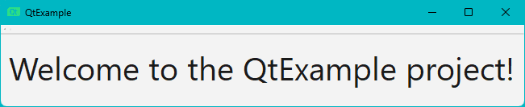

# minipass

A minimalistic command-line password generator with customizable settings.

## Requirements

 - Cmake v3.30.2
 - GTest v1.12.1
 - MinGW-w64 v4.4.1 (Windows)
 - GCC v14.2 (Linux)
 - Qt6 v6.7.2

## Installation

Windows:

1. [Install Cmake](https://cmake.org/download).

2. [Install GTest](https://github.com/google/googletest/blob/main/googletest/README.md):

    ```powershell
    $ cd C:\Program Files
    $ git clone https://github.com/microsoft/vcpkg.git
    $ cd vcpkg 
    $ .\bootstrap-vcpkg.bat
    $ $env:VCPKG_ROOT = "C:\Program Files\vcpkg"
    $ $env:PATH = "$env:VCPKG_ROOT;$env:PATH"
    $ vcpkg install gtest
    ```

3. [Install MinGW-w64 via MSYS2](https://code.visualstudio.com/docs/cpp/config-mingw).

4. Add the MinGW install location to PATH:

    ```powershell
    $env:PATH = "C:\msys64\ucrt64\bin;$env:PATH"
    ```

5. [Install Qt6 via Qt Online Installer](https://doc.qt.io/qt-6/qt-online-installation.html): 

6. Add the Qt6 install location to PATH:

    ```powershell
    $env:PATH = "C:\Qt\6.7.2\mingw_64\bin;$env:PATH"
    ```

Linux:

1. Install Cmake:

    ```bash
    $ sudo apt-get -y install cmake
    ```

2. Install GTest:

    ```bash
    $ sudo apt-get -y install libgtest-dev
    ```

3. Install gcc:

    ```bash
    $ sudo apt-get -y install build-essential
    ```

4. [Install Qt6](https://web.stanford.edu/dept/cs_edu/resources/qt/install-linux).

## Usage

Windows:

```powershell
$ git clone https://github.com/callmebohdan/minipass.git
$ cd minipass
$ .\scripts\build_and_run.bat
$ .\bin\minipassCLI.exe [options]
$ .\bin\minipassGUI.exe
```

Linux:

```bash
$ git clone https://github.com/callmebohdan/minipass.git
$ cd minipass
$ [ -d "build" ] && cmake --build build --target clean 
$ cmake -S . -B build
$ cmake --build build --config Release
$ .\build\src\MiniPass [options]
```

## Options

| Short  | Long         | Purpose                                              | Output |
|:------:|:------------:|------------------------------------------------------|--------|
| -h     | --help       | Display this help message and exit.                  | 
| -d     | --default    | Generate a password with default settings.           | Random Password: 5n\`Dt\|x\]\]WU1JHy> |
| -l N   | --length N   | Set the length (N) of the password (default: 16).    | Random Password: I.aOo^s9SPJ-.QI=9rolZJ^55 |
| -n     | --numbers    | Exclude numbers from the password.                   | Random Password: Pw\|/X-KfXNnF.o&m |
| -o     | --lower      | Exclude lowercase letters from the password.         | Random Password: CU!=[C[4@V_D\L\% |
| -u     | --upper      | Exclude uppercase letters from the password.         | Random Password: o"lh?eg;l2gb`3%. |
| -s     | --special    | Exclude special characters from the password.        | Random Password: 8UqA7b260Od9Zd7m |
| -k     | --history    | Save generated passwords in history.                 | Random Password: &%8Oi\f1_W3bPw`@ |
|        |              |                                                      | Password saved to /build/bin/PasswordsHistory.csv |
| -m     | --mnemonic   | Create a mnemonic password.                          | Random Password: kupsxettpiaizjmx |
|        |              |                                                      | Mnemonic Phrase: kingdom update pressure study xerox era terminal type preview icon axis insight zucchini justice media xerox |
| -c STR | --custom STR | Exclude specific characters (STR) from the password. | Random Password: 9"Y"9yzyy`"}~ZY~ |

## Example



## Testing with GTest

Windows:

1. Test minipass.cpp:
    ```powershell
    .\bin\TestMinipass.exe
    ```

2. Test utils.cpp:
    ```powershell
    .\bin\TestUtils.exe
    ```

Linux:

1. Test minipass.cpp:
    ```bash
    ./build/test/TestMinipass
    ```

2. Test utils.cpp:
    ```bash
    ./build/test/TestUtils
    ```
