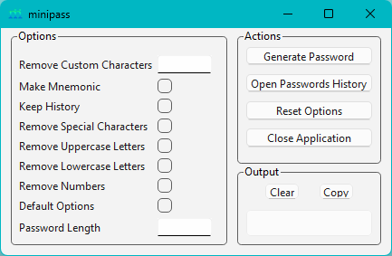
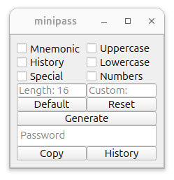

# minipass

A minimalistic command-line password generator with customizable settings.

## Dependencies

 - MSVC2019_64 (Windows)
 - GCC v14.2 (Linux)
 - Cmake v3.30.2 (Windows, Linux)
 - Qt6 v6.7.2 (Windows, Linux)
 - GTest v1.12.1 (Windows, Linux)

## Install dependencies

Windows:

```powershell
.\scripts\install.bat
```

Linux:

```bash
bash scripts/install.sh
```

## Build the project

Windows:

1. Clone the repository:

    ```powershell
    git clone https://github.com/callmebohdan/minipass.git
    ```

2. Navigate to the project directory:

    ```powershell
    cd minipass
    ```

3. Build the project:

    ```powershell
    .\scripts\build.bat
    ```

4. Clean previous builds:

    ```powershell
    .\scripts\clean.bat
    ```

Linux:

1. Clone the repository:

    ```bash
    git clone https://github.com/callmebohdan/minipass.git
    ```

2. Navigate to the project directory:

    ```bash
    cd minipass
    ```

4. Build the project:

    ```bash
    sudo bash ./scripts/build.sh
    ```

5. Clean previous builds:

    ```bash
    bash ./scripts/clean.sh
    ```

## Usage

Windows:

```powershell
.\bin\minipass.exe [options]
```

Linux

```bash
minipass [options]
```

## Options

| Short  | Long | Purpose | Input | Output |
|:------:|:------------:|:------:|:------:|:------:|
| -h     | --help       | Print help                 | 
| -d     | --default    | Default program options          | minipass -d | 5n\`Dt\|x\]\]WU1JHy> |
| -l N   | --length N   | Set password length   | minipass -l 16 | I.aOo^s9SPJ-.QI=9rolZJ^55 |
| -n     | --numbers    | Use numbers: 0-9                  | minipass -l 16 -n | Pw\|/X-KfXNnF.o&m |
| -o     | --lower      | Use lowercase letters: a-z       | minipass -l 16 -o | CU!=[C[4@V_D\L\% |
| -u     | --upper      | Use uppercase letters: A-Z       | minipass -l 16 -u | o"lh?eg;l2gb`3%. |
| -s     | --special    | Use special characters: !\"#$%&'()*+,-./:;<=>?@[\\]^_`{|}~      | minipass -l 16 -s | 8UqA7b260Od9Zd7m |
| -k     | --history    | Keep passwords history                | minipass -l 16 -k | &%8Oi\f1_W3bPw`@ |
| -m     | --mnemonic   | Make mnemonic password                         | minipass -l 16 -m | kupsxettpiaizjmx (kingdom update pressure study xerox era terminal type preview icon axis insight zucchini justice media xerox) |
| -c STR | --custom STR | Use custom characters | minipass -l 16 -c 12345678abc | 9"Y"9yzyy`"}~ZY~ |

## Example

Windows:



Linux:



## Testing with GTest

Windows:

1. Test minipass.cpp:
    ```powershell
    .\bin\GoogleTestMinipass.exe
    ```

Linux:

1. Test minipass.cpp:
    ```bash
    ./build/GoogleTestMinipass
    ```

## Troubleshooting

1. To fix the **Warning: Ignoring XDG_SESSION_TYPE=wayland on Gnome. Use QT_QPA_PLATFORM=wayland to run on Wayland anyway** run:

    ```bash
    export QT_QPA_PLATFORM=xcb
    ```

## Release

1. Update version.json with the new version and description:

    ```bash
    git add version.json
    ```

2. Commit the changes to version.json:

    ```bash
    git commit -m "Update version to v0.1.0"
    ```

3. Create the tag:

    ```bash
    git tag v0.1.0
    ```

4. Push the tag:

    ```bash
    git push origin v0.1.0
    ```
