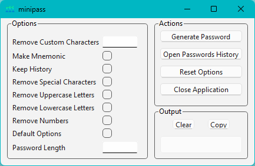
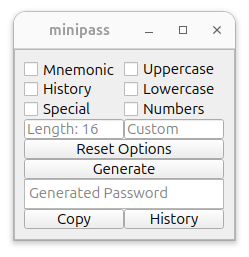

# minipass

A minimalistic command-line password generator with customizable settings.

## Requirements

 - Cmake v3.30.2
 - MSVC2019_64 (Windows)
 - GCC v14.2 (Linux)
 - Qt6 v6.7.2
 - GTest v1.12.1

## Requirements installation

Windows:

1. [Install Cmake](https://cmake.org/download).

2. [Install Qt6 via Qt Online Installer](https://doc.qt.io/qt-6/qt-online-installation.html).
Also install MSVC2019_64 (Qt Maintenance Tool -> Add or remove components -> Qt -> Qt 6.7.2 -> MSVC 2019 64-bit).

3. Add the Qt6 install location to PATH:

    ```powershell
    $env:PATH = "C:\Qt\6.7.2\mingw_64\bin;$env:PATH"
    ```

4. [Install GTest](https://github.com/google/googletest/blob/main/googletest/README.md):

    ```powershell
    cd C:\Program Files
    ```
    
    ```powershell
    git clone https://github.com/microsoft/vcpkg.git
    ```
    
    ```powershell
    cd vcpkg
    ```

    ```powershell
    .\bootstrap-vcpkg.bat
    ```
    
    ```powershell
    $env:VCPKG_ROOT = "C:\Program Files\vcpkg"
    ```

    ```powershell
    $env:PATH = "$env:VCPKG_ROOT;$env:PATH"
    ```

    ```powershell
    vcpkg install gtest
    ```

Linux:

1. Install Cmake:

    ```bash
    sudo apt-get -y install cmake
    ```
  
2. Install gcc:

    ```bash
    sudo apt-get -y install build-essential
    ```

3. Install Qt6:

    ```bash
    sudo apt-get -y install libgl1-mesa-dev libglu1-mesa-dev freeglut3-dev mesa-common-dev qt6-base-dev qt6-base-dev-tools libxcb-cursor0
    ```

4. Install GTest:

    ```bash
    sudo apt-get -y install libgtest-dev
    ```

   Build and install static libraries:
   
    ```bash
    cd /usr/src/gtest && sudo cmake . && sudo make && sudo mv libg* /usr/lib/ && cd -
    ```

## Build

Windows:

1. Clone the repository:

    ```powershell
    git clone https://github.com/callmebohdan/minipass.git
    ```

2. Navigate to the project directory:

    ```powershell
    cd minipass
    ```

3. Build the project:

    ```powershell
    .\scripts\build.bat
    ```

4. Run minipass:

    ```powershell
    .\bin\minipass.exe
    ```

5. Clean previous builds:

    ```powershell
    .\scripts\clean.bat
    ```

Linux:

1. Clone the repository:

    ```bash
    git clone https://github.com/callmebohdan/minipass.git
    ```

2. Navigate to the project directory:

    ```bash
    cd minipass
    ```

3. Build the project:

    ```bash
    sh ./scripts/build.sh
    ```

4. Run minipass:

    ```bash
    ./bin/minipass
    ```

5. Clean previous builds:

    ```bash
    sh ./scripts/clean.sh
    ```

5. To fix the **Warning: Ignoring XDG_SESSION_TYPE=wayland on Gnome. Use QT_QPA_PLATFORM=wayland to run on Wayland anyway** run:

    ```bash
    export QT_QPA_PLATFORM=xcb
    ```

## Usage

Windows:

```powershell
.\bin\minipass.exe [options]
```

Linux

```bash
./bin/minipass [options]
```

## Options

| Short  | Long | Purpose | Input | Output |
|:------:|:------------:|:------:|:------:|:------:|
| -h     | --help       | Display this help message and exit.                 | 
| -d     | --default    | Generate a password with default settings.          | minipass -d | 5n\`Dt\|x\]\]WU1JHy> |
| -l N   | --length N   | Set the length (N) of the password (default: 16).   | minipass -l 16 | I.aOo^s9SPJ-.QI=9rolZJ^55 |
| -n     | --numbers    | Exclude numbers from the password.                  | minipass -l 16 -n | Pw\|/X-KfXNnF.o&m |
| -o     | --lower      | Exclude lowercase letters from the password.        | minipass -l 16 -o | CU!=[C[4@V_D\L\% |
| -u     | --upper      | Exclude uppercase letters from the password.        | minipass -l 16 -u | o"lh?eg;l2gb`3%. |
| -s     | --special    | Exclude special characters from the password.       | minipass -l 16 -s | 8UqA7b260Od9Zd7m |
| -k     | --history    | Save generated passwords in history.                | minipass -l 16 -k | &%8Oi\f1_W3bPw`@ |
| -m     | --mnemonic   | Create a mnemonic password.                         | minipass -l 16 -m | kupsxettpiaizjmx (kingdom update pressure study xerox era terminal type preview icon axis insight zucchini justice media xerox) |
| -c STR | --custom STR | Exclude specific characters (STR) from the password.| minipass -l 16 -c 12345678abc | 9"Y"9yzyy`"}~ZY~ |

## Example

Windows:



Linux:



## Testing with GTest

Windows:

1. Test minipass.cpp:
    ```powershell
    .\bin\TestMinipass.exe
    ```

Linux:

1. Test minipass.cpp:
    ```bash
    ./bin/TestMinipass
    ```
